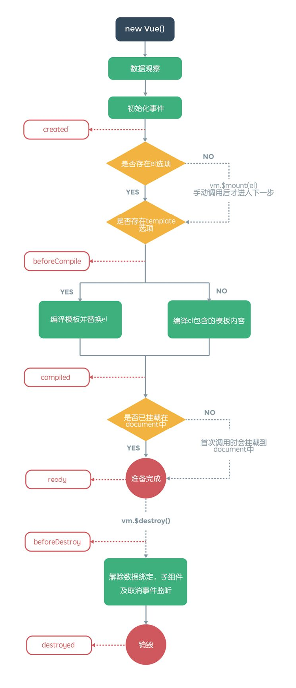

# 2.1.4 生命周期

**Vue.js实例在创建时有一系列的初始化步骤**

**在此过程中，我们可以通过一些定义好的生命周期钩子函数来运行业务逻辑**

+ ~~init:~~ 在实例开始初始化时同步调用。此时数据观测、事件等都尚未初始化。2.0中更名为**beforeCreate**
+ **created**：在实例创建之后调用。此时已完成数据绑定、事件方法，但尚未开始DOM编译，即未挂载到document中。
+ ~~beforeCompile:~~ 在DOM编译前调用。2.0废弃了该方法，推荐使用created。
+ **beforeMount**: 2.0新增的生命周期钩子，在mounted之前运行。
+ ~~compiled:~~ 在编译结束时调用。此时所有指令已生效，数据变化已能触发DOM更新，但不保证$el已插入文档。2.0中更名为**mounted**。
+ ~~ready:~~ 在编译结束和$el第一次插入文档之后调用。2.0废弃了该方法，推荐使用mounted。这个变化其实已经改变了ready这个生命周期状态，相当于取消了在$el首次插入文档后的钩子函数。
+ ~~attached：~~ 在vm.$el插入DOM时调用，ready会在第一次attached后调用。2.0废弃了该方法，推荐在其他钩子中自定义方法检查是否已挂载。
+ ~~detached:~~ 同attached类似，该钩子在vm.$el从DOM删除时调用，而且必须是指令或实例方法。2.0中同样废弃了该方法。
+ **beforeDestroy**: 在开始销毁实例时调用，此刻实例仍然有效。
+ **destroyed**: 在实例被销毁之后调用。此时所有绑定和实例指令都已经解绑，子实例也被销毁。
+ **beforeUpdate**: 2.0新增的生命周期钩子，在实例挂载之后，再次更新实例（例如更新data）时会调用该方法，此时尚未更新DOM结构。
+ **updated**:2.0新增的生命周期钩子，在实例挂载之后，再次更新实例并更新完DOM结构后调用。
+ **activated**：2.0新增的生命周期钩子，需要配合动态组件keep-live属性使用。在动态组件初始化渲染的过程中调用该方法。
+ **deactivated**：2.0新增的生命周期钩子，需要配合动态组件keep-live属性使用。在动态组件移出的过程中调用该方法。