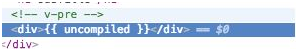

<!--
 * @Author: zhanglingdi
 * @Date: 2019-12-03 16:34:55
 * @Email: 980583728@qq.com
 * @Company: Sinovatio
 * @version: v0.0.1
 * @LastEditors: zhanglingdi
 * @LastEditTime: 2019-12-03 17:05:53
 * @Description: test
 -->
# 3.1.10 v-pre

v-pre指令相对简单，就是跳过编译这个元素和子元素，显示原始的\{\{\}\}Mustache标签，用来减少编译时间。例如：

```javascript
<div v-pre>{{ uncompiled}}</div>
var vm = new Vue({
　el : '#app',
　data: {
　　uncompiled : 'Thers is an uncompiled element'
　}
});
```

最后输出：
