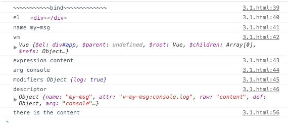

<!--
 * @Author: zhanglingdi
 * @Date: 2019-12-03 16:57:12
 * @Email: 980583728@qq.com
 * @Company: Sinovatio
 * @version: v0.0.1
 * @LastEditors: zhanglingdi
 * @LastEditTime: 2019-12-04 09:22:34
 * @Description: test
 -->
# 3.2.3 指令实例属性

在指令的钩子函数内，可以通过this来调用指令实例

+ el：指令绑定的元素。

+ vm：该指令的上下文ViewModel，可以为new Vue()的实例，也可以为组件实例。

+ expression：指令的表达式，不包括参数和过滤器。

+ arg：指令的参数。

+ name：指令的名字，不包括v-前缀。

+ modifiers：一个对象，包含指令的修饰符。

+ descriptor：一个对象，包含指令的解析结果。

我们可以通过以下这个例子，更直观地了解到这些属性：
```javascript
<div v-my-msg:console.log="content"></div>
Vue.directive('my-msg', {
　bind : function() {
　　console.log('~~~~~~~~~~~bind~~~~~~~~~~~~~');
　　console.log('el', this.el);
　　console.log('name', this.name);
　　console.log('vm', this.vm);
　　console.log('expression', this.expression);
　　console.log('arg', this.arg);
　　console.log('modifiers', this.modifiers);
　　console.log('descriptor', this.descriptor);
　},
　update : function(newValue, oldValue) {
　　var keys = Object.keys(this.modifiers);　　
　　window[this.arg][keys[0]](newValue);
　},
　unbind : function() {
　}
});
var vm = new Vue({
　el : '#app',
　data : {
　　content : 'there is the content'
　}
});
```
输出结果如下：
