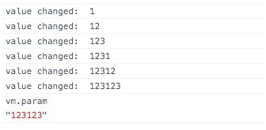
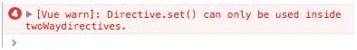

<!--
 * @Author: zhanglingdi
 * @Date: 2019-12-04 09:27:31
 * @Email: 980583728@qq.com
 * @Company: Sinovatio
 * @version: v0.0.1
 * @LastEditors: zhanglingdi
 * @LastEditTime: 2019-12-04 09:40:00
 * @Description: test
 -->
# 3.3.3 twoWay

在自定义指令中，如果需要向Vue实例写回数据，就需要在定义对象中使用twoWay:true，这样可以在指令中使用this.set(value)来写回数据。

```javascript
<input type="text" v-my-twoway-directive="param" / >
Vue.directive('my-twoway-directive', {
　twoWay : true,
　bind : function() {
　　this.handler = function () {
　　　console.log('value changed: ', this.el.value);
　　　this.set(this.el.value)
　　}.bind(this)
　　this.el.addEventListener('input', this.handler)
　},
　unbind: function () {
　　this.el.removeEventListener('input', this.handler)
　}
});
var vm = new Vue({
　el : '#app',
　data : {
　　param : 'first',
　}
});
```
此时在input中输入文字，然后在控制台中输入vm.param即可观察到实例的param属性已被改变。



需要注意的是，如果没有设定twoWay:true，就在自定义指令中调用this.set(), Vue.js会抛出异常。


