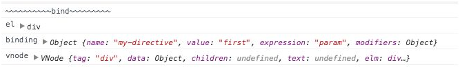

<!--
 * @Author: zhanglingdi
 * @Date: 2019-12-04 10:17:59
 * @Email: 980583728@qq.com
 * @Company: Sinovatio
 * @version: v0.0.1
 * @LastEditors: zhanglingdi
 * @LastEditTime: 2019-12-04 10:38:05
 * @Description: test
 -->
# 3.4.2 钩子函数实例和参数变化

在Vue.js 2.0中取消了指令实例这一概念，即在钩子函数中的this并不能指向指令的相关属性。指令的相关属性均通过参数的形式传递给钩子函数。

```javascript
Vue.directive('my-directive', {
　bind : function(el, binding, vnode) {
　　console.log('~~~~~~~~~~bind~~~~~~~~~');
　　console.log('el', el);
　　console.log('binding', binding);
　　console.log('vnode', vnode);
　},
　update : function(el, binding, vnode, oldVNode) {
　　….
　},
　componentUpdated(el, binding, vnode, oldVNode) {
　　….
　},
　unbind : function(el, binding, vnode) {
　　….
　}
});
```



在Vue.js 1.0的实例中的属性大部分都能在binding中找到，vnode则主要包含了节点的相关信息，有点类似于fragment的作用。