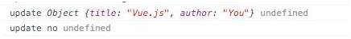

<!--
 * @Author: zhanglingdi
 * @Date: 2019-12-03 16:57:12
 * @Email: 980583728@qq.com
 * @Company: Sinovatio
 * @version: v0.0.1
 * @LastEditors: zhanglingdi
 * @LastEditTime: 2019-12-04 09:21:05
 * @Description: test
 -->
# 3.2.2 指令的定义对象

我们在注册指令的同时，可以传入definition定义对象，对指令赋予一些特殊的功能。这个定义对象主要包含三个钩子函数：**bind、 update和 unbind。**

+ bind: 只被调用一次，在指令第一次绑定到元素上时调用。

+ update：指令在bind之后以初始值为参数进行第一次调用，之后每次当绑定值发生变化时调用，update接收到的参数为newValue和oldValue

+ unbind：指令从元素上解绑时调用，只调用一次。

这三个函数都是可选函数，但注册一个空指令肯定没有意义，来看下面这个例子，会使我们对整个指令周期有更明确的认识。

```javascript
<div v-if="isExist" v-my-directive="param"></div>
Vue.directive('my-directive', {
　bind : function() {
　　console.log('bind', arguments);
　},
　update : function(newValue, oldValue) {
　　console.log('update', newValue, oldValue)
　},
　unbind : function() {
　　console.log('unbind', arguments);
　}
})
var vm = new Vue({
　el : '#app',
　data : {
　　param : 'first',
　　isExist : true
　}
});
```

我们在控制台里先后输入vm.param ='second'和vm.isExist = false，整体输出如下：


另外，如果我们只需要使用update函数时，可以直接传入一个函数代替定义对象：

```javascript
Vue.directive('my-directive', function(value) {
　// 该函数即为update函数
});
```
上述例子中，可以使用my-directive指令绑定的值是data中的param属性。也可以直接绑定字符串常量，或使用字面修饰符，但这样的话需要注意update方法将只调用一次，因为普通字符串不能响应数据变化。

```
<div v-my-directive="constant string"/></div>　// -> value为undefined，因为data中没有对应的属性
<div v-my-direcitve="'constant string'"></div> // -> value 为constant string，绑定字符串需要加单引号
<div v-my-directive.literal="constant string"></div> // -> value 为constant string，利用字面修饰符后无需使用单引号
```
除了字符串外，指令也能接受对象字面量或任意合法的JavaScript表达式。例如：

```
<div v-my-directive="{ title : 'Vue.js', author : 'You'}"></div>
<div v-my-directive="isExist ? 'yes' : 'no'" ></div>
```



注意此时对象字面量不需要用单引号括起来，这和字符串常量不一样。