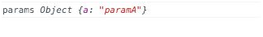
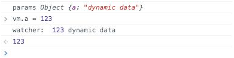

<!--
 * @Author: zhanglingdi
 * @Date: 2019-12-04 09:27:31
 * @Email: 980583728@qq.com
 * @Company: Sinovatio
 * @version: v0.0.1
 * @LastEditors: zhanglingdi
 * @LastEditTime: 2019-12-04 09:30:07
 * @Description: test
 -->
# 3.3.1 params

定义对象中可以接受一个params数组，Vue.js编译器将自动提取自定义指令绑定元素上的这些属性。例如：

```javascript
<div v-my-advance-directive a="paramA"></div>
Vue.directive('my-advance-directive', {
　params : ['a'],
　bind : function() {
　　console.log('params', this.params);
　}
});
```



除了直接传入数值外，params支持绑定动态数据，并且可以设定一个watcher监听，当数据变化时，会调用这个回调函数。例如：

```javascript
<div v-my-advance-directive v-bind:a="a"></div> // 当然也可以简写成　
<div v-my-advance-directive :a="a"></div>
Vue.directive('my-advance-directive', {
　params : ['a'],
　paramWatchers : {
　　a : function(val, oldVal) {
　　　  console.log('watcher: ', val, oldVal)
　　}
　},
　bind : function() {
　　console.log('params', this.params);
　}
});
var vm = new Vue({
　el : '#app',
　data : {
　　a : 'dynamitc data'
　}
});
```

