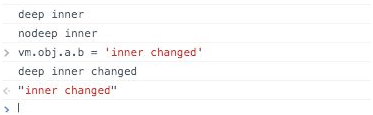

# 3.3.2 ~~deep~~

当自定义指令作用于一个对象上时，我们可以使用deep选项来监听对象内部发生的变化。例如：

```javascript
<div v-my-deep-directive="obj"></div>
<div v-my-nodeep-directive="obj"></div>
Vue.directive('my-deep-directive', {
　deep : true,
　update : function(newValue, oldValue) {
　　console.log('deep', newValue.a.b);
　}
});
Vue.directive('my-nodeep-directive', {
　update : function(newValue, oldValue) {
　　console.log('deep', newValue.a.b);
　}
});
var vm = new Vue({
　el : '#app',
　data : {
　　obj : {
　　　a : {
　　　　b : 'inner'
　　　}
　　}
　}
})
```
运行后，在控制台中输入vm.obj.a.b = 'inner changed', 只有my-deep-directive调用了update函数，输出了改变后的值。



**Vue.js 2.0中废弃了该选项。**