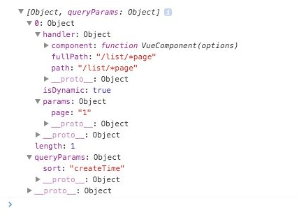

# 7.1 Vue-router

Vue-router是给Vue.js提供路由管理的插件，利用hash的变化控制动态组件的切换。

引用方式如下：

```javascript
import Vue from 'vue'; 
import VueRouter from 'vue-router'; 
Vue.use(VueRouter);
```

## 基本用法

vue-router的基本作用就是将每个路径映射到对应的组件，并通过修改路由进行组件间的切换。常规路径规则为在当前url路径后面加上#!/path，path即为设定的前端路由路径。例如：

```html
<div id="app">
 <nav class="navbar navbar-inverse">
  <div class="container">
    <div class="collapse navbar-collapse">
      <ul class="nav navbar-nav">
        <li>
          <!—使用 v-link 指令，path的值对应跳转的路径，即#!/home -->
          <a v-link="{ path : '/home'}">Home</a>
        </li>
        <li>
          <a v-link="{ path : '/list'}">List</a>
        </li>
      </ul>
    </div>
  </div>
 </nav>
 <div class="container">
 <!—路由切换组件template插入的位置 -->
  <router-view></router-view>
  </div>
 </div>
```

js代码：

```javascript
// 创建子组件，相当于路径对应的页面
var Home = Vue.extend({
 template : '<h1>This is the home page</h1>'
});

// 创建根组件
var App = Vue.extend({})

// 创建路由器实例
var router = new VueRouter()

// 通过路由器实例定义路由规则（需要在启动应用前定义好）
// 每条路由会映射到一个组件。这个值可以是由Vue.extend创建的组件构造函数（如Home）
// 也可以直接使用组件选项对象（如'/list'中component对应的值）
router.map({
 '/home': {
   component: Home
 },
 '/list': {
   component : {
     template: '<h1>This is the List page</h1>'
   }
 }
})

// 路由器实例会创建一个Vue实例，并且挂载到第二个参数元素选择器匹配的DOM上
router.start(App, '#app')
```

## 嵌套路由

一般应用中的路由方式不会像上述例子那么简单，往往会出现二级导航这种情况。这时就需要使用嵌套路由这种写法。我们给上述例子添加一个Biz组件，包含一个嵌套的router-view，修改如下：

```javascript
var Biz = Vue.extend({
  template : '<div> \
     <h1>This is the some business channel</h1> \
     <div class="container"> \
       <ul class="nav navbar-nav"> \
         <li> \
           <a v-link="{ path : \'/biz/list\'}">List</a> \
         </li> \
         <li> \
           <a v-link="{ path : \'/biz/detail\'}">Detail</a> \
         </li> \
       </ul> \
     </div> \
     <router-view></router-view> \
   </div>'
});
```

路由配置修改如下：

```javascript
router.map({
  '/home': {
       component: Home
  },
  '/biz': {
     component : Biz,
     subRoutes : {
        '/list' : {
            component : {
              template : '<h2>This is the business list page</h2>'
            }
        },
       '/detail' : {
          component : {
            template : '<h2>This is the business detail page</h2>'
          }
       }
     }
  }
})
```

## 路由匹配

Vue-router在设置路由规则的时候，支持以冒号开头的动态片段。例如在设计列表分页的情况下，我们往往会在url中带入列表的页码，路由规则就可以这么设计：

```javascript
router.map({
  '/list/:page': {
     component : {
       template: '<h1>This is the No.{{  $route.params.page }} page</h1>'
     }
  }
})
```

一条路由规则中支持包含多个动态片段，例如：

```javascript
router.map({
  '/list/:page/:pageSize': {
     component : {
       template: '<h1>This is the No.{{ $route.params.page }} page, {{ $route.params.pageSize }} per page</h1>'
     }
  }
})
```

<p style="color:red; font-size:16px;">除了以冒号:开头的动态片段:page外，Vue-router还提供了以*号开头的全匹配片段。全匹配片段会包含所有符合的路径，而且不以'/'为间隔。例如在路由/list/:page中，规则能匹配/list/1,/list/2路径，但无法匹配/list/1/10这样的路径。而/list/*page则可以匹配/list/1, 以及/list/1/10这样的路径，不会因为'/'而中断匹配。page值也就成为整个匹配到的字符串，即1或1/10。</p>

## 具名路由

在设置路由规则时，我们可以给路径名设置一个别名，方便进行路由跳转，而不需要去记住过长的全路径。例如：

```javascript
router.map({
  '/list/:page': {
    name: 'list'
    component : {
      template: '<h1>This is the No.{{ $route.params.page }} page</h1>'
    }
  }
})
```

我们就可以使用v-link指令链接到该路径

`<a v-link="{ name: 'list', params: { page : 1 }}">List</a>`

## 路由对象

在使用Vue-router启动应用时，每个匹配的组件实例中都会被注入router的对象，称之为路由对象。在组件内部可以通过this.$route的方式进行调用。

路由对象总共包含了以下几个属性：

1. $route.path  
    类型为字符串，为当前路由的绝对路径，如/list/1。

2. $route.params    
    类型为对象。包含路由中动态片段和全匹配片段的键值对。如上述例子中的/list/:page路径，就可以通过this.$route.params.page的方式来获取路径上page的值。

3. $route.query    
    类型为对象。包含路由中查询参数的键值对。例如/list/1?sort=createTime, 通过this.$route.query.sort即可得到createTime。

4. $route.router    
    即路由实例，可以通过调用其go，replace方法进行跳转。我们在组件实例中也可以直接调用this.$router来访问路由实例。router具体的属性和api方法将在7.1.10路由实例中进行说明。

5. $route.matched   
    类型为数组。包含当前匹配的路径中所有片段对应的配置参数对象。例如在/list/1?sort= createTime路径中，$route.matched值如下：

    

6. $route.name  
    类型为字符串，即为当前路由设置的name属性。

## v-link

v-link是vue-router应用中用于路径间跳转的指令，其本质是调用路由实例router本身的go函数进行跳转。该指令接受一个JavaScript表达式，而且可以直接使用组件内绑定的数据。

常见的使用方式包含以下两种：

1. 直接使用字面路径：   
    `<a v-link="'home'">Home</a>`　// 注意这里双引号里的home需要加上单引号，不然会变成读取组件data属性中的home值。
    或者写成：`<a v-link="{ path : 'home'}">Home</a>`

2. 使用具名路径，并可以通过params或query设置路径中的动态片段或查询变量：    
    `<a v-link="{ name : 'list', params: { page : 1}}">List Page 1</a>`

此外，v-link还包含其他参数选项：

1. activeClass  
    类型为字符串，如果当前路径包含v-link中path的值，该元素会自动添加activeClass值的类名，默认为v-link-active。

2. exact    
    类型为布尔值。在判断当前是否为活跃路径时，v-link默认的匹配方式是包容性匹配，即如果v-link中path为/list，那以/list路径为开头的所有路径均为活跃路径。而设置exact为true后，则只有当路径完全一致时才认定为活跃路径，然后添加class类名。

3. replace    
    类型为布尔值。若replace值设定为true，则点击链接时执行的是router.replace()方法，而不是router.go()方法。由此产生的跳转不会留下历史记录。

4. append   
    类型为布尔值。若append值设定为true，则确保链接的相对路径添加到当前路径之后。例如在路径/list下，设置链接`<a v-link="{path: '1', append : true}">1</a>`，点击则路径变化为/list/1；若不设置append:true, 路径变化为/1。

## 路由配置项

在创建路由器实例的时候，Vue-router提供了以下参数可供我们配置：

1. hashbang     
    默认值为true，即只在hash模式下可用。当hashbang值为true时，所有的路径会以#!为开头。例如`<a v-link="{ path : '/home'}">Home</a>`，浏览器路径即为http://hostname/#!/home 

2. history      
    默认值为false。设为true时会启动HTML5 history模式，利用history.pushState()和history.replaceState()来管理浏览历史记录。

3. abstract     
    默认值为false。提供了一个不依赖于浏览器的历史管理工具。在一些非浏览器场景中会非常有用，例如electron（桌面软件打包工具，类似于node-webkit）或者cordova（native app打包工具，前身为phonegap）应用。

4. root    
    默认值为null，仅在HTML5 history模式下可用。可设置一个应用的根路径，例如：/app。这样应用中的所有跳转路径都会默认加在这个根路径之后，例如`<a v-link='/home'>Home</a>`，路径即变化为/app/home。

5. linkActiveClass      
    默认值为v-link-active。与v-link中的activeClasss选项类似，这里相当于是一个全局的设定。符合匹配规则的链接即会加上linkActiveClass设定的类名。

6. saveScrollPosition       
    默认值为false，仅在HTML5 history模式下可用。当用户点击后退按钮时，借助HTML5 history中的popstate事件对应的state来重置页面的滚动未知。需要注意的是，当router-view设置了场景切换效果时，该属性不一定能生效。

7. transitionOnLoad     
    默认值为false。在router-view中组件初次加载时是否使用过渡效果。默认情况下，组件在初次加载时会直接渲染，不使用过渡效果。

8. suppressTransitionError      
    默认值为false。设定为true后，将忽略场景切换钩子函数中发生的异常。

## route钩子函数

在使用Vue-router的应用中，每个路由匹配到的组件中会多出一个route选项。在这个选项中我们可以使用路由切换的钩子函数来进行一定的业务逻辑操作。以下面代码为例，介绍这些钩子函数的运行机制和触发时机。

```javascript
var List = Vue.extend({
  template : '<h1>This is the No.{{ $route.params.page }} page</h1>',
  route : {
    data : function(transition) {
      console.log('data');
      transition.next();
    },
    activate : function(transition) {
      console.log('activate');
      transition.next();
    },
    deactivate: function(transition) {
      console.log(deactivate);
      transition.next();
    },
    canActivate : function(transition) {
      console.log('canActivate');
      transition.next();
    },
    canDeactivate : function(transition) {
      console.log('canDeactivate');
      transition.next();
    },
    canReuse : function(transition) {
      console.log('canReuse');
      return true;
    }
  }
});
```

由上面这个例子可以看出，route提供了6个钩子函数，分别如下。

+ canActivate(): 在组件创建之前被调用，验证组件是否可被创建。

+ activate():在组件创建且将要加载时被调用。

+ data():在activate之后被调用，用于加载和设置当前组件的数据。

+ canDeactivate():在组件被移出前被调用，验证是否可被移出。

+ deactivate():在组件移出时调用。

+ canReuse():决定组件是否可被重用。这种场景通常发生在/list/1切换到/list/2时，如果canReuse返回值为true，则组件在切换后会略过canActivate和activate两个阶段，直接调用data钩子函数。若canReuse返回值为false，则需完整经历激活的三个钩子函数。

我们可以利用上文中的List组件设置一个路由规则：

```javascript
router.map({
  '/home': {
     component: {
        template : '<h1>This is the home page</h1>',
     }
  },
  '/list/:page': {
     component : List
  }
})
```

在home和list之间切换，我们可以看到控制台输出结果如下：

```text
canActivate
activate
data
canDeactivate
deactivate
```

在/list/1与/list/2之间切换，结果如下:

```text
canActivate
activate
data
canReuse
data
```

在每个钩子函数中，都接受一个transition对象作为参数，我们称之为切换对象。主要包含以下属性和方法。

+ transition.to: 将要切换到路径的路由对象（路由对象详见第7.1.6小节）。

+ transition.from: 当前路径的路由对象。

+ transition.next(): 可以通过调用该方法使切换过程进入下一阶段，这样也就支持了在钩子函数内部使用异步方法的情况。比如进入某个路径前我们需要校验用户是否具有某种权限，而这一般需要和后端进行数据交互来进行验证。我们只需要在异步的回调函数中执行transition.next()即可确保在获取到数据后才执行切换过程的下一阶段。

+ transition.abort([reason]): 调用该方法可以终止或者拒绝此次切换。需要注意的是，在activate和deactivate中调用该方法时并不会把应用退到前一个路由状态，只有在canActivate和canDeactivate内调用才会回退。

+ transition.redirect(path): 取消当前切换并重定向到另一个路由。参数接受字符串或者路由对象，并且如果不设定新的params和query的话，会保留原始transition.to的params和query。

另外，这些钩子函数在切换过程中也起到了不同的作用，我们分类说明如下。

activate/deactivate: 返回值可为Promise对象。ES6提供了原生的Promise对象，可以通过直接返回Promise.resolve(true)/Promise.reject([reason])来控制是否进行切换的下一步，或者返回return new Promise(function (resolve, reject){resolve(true)/reject([reason]) })。

canActivate/canDeactivate: 返回值可以是同activate/deactivate一样的Promise对象，也可以是布尔值true/false，和使用切换对象transition.next()/transition.abort()效果一致。

data:data钩子在每次路由变动的时候都会被调用，特别是当组件被重用时，往往跳过activate只执行data函数，如上述例子中的/list/1切换到/list/2。所以我们经常把加载动态数据放在data钩子中执行，而且当组件从activate切换到data钩子时，会得到一个$loadingRouteData属性，默认值为true，当data函数执行完进入下一步时将切换成false。这样有助于我们做一些loading等待方面的处理，避免用户长时间得不到反馈。与其他钩子函数不同的是，我们可以在调用data函数的transition.next(data)时传入一个data对象，可以为组件的data附上相应的属性值。例如：

```javascript
route: {
  data : function(transition) {
    transition.next({ page : transition.to.params.page })
  }
}
```

这样就可以赋值给了组件的data.page。另外，还可以通过Promise的then回调函数中的返回值来设置，例如：

```javascript
route: {
  data : function() {
    return Promise.all([
      // 后端数据接口，需要符合Promise形式，或可通过vue-resource插件实现
      // 详情可见第7.2节中的vue-resource的相关说明
      userService.getInfo(),
      productsService.getList()
    ]).then(function(reps){
      return {
        user : reps[0],
        products : reps[1]
      }
    })
  }
}
```

## 路由实例属性及方法

在Vue-router启动的应用中，每个组件会被注入router实例，可以在组件内通过this.$router（或者使用路由对象$route.router）进行访问。这个router实例主要包含了一些全局的钩子函数，以及配置路由规则，进行路由切换等api。本节主要介绍路由实例的主要属性和api方法。

主要的公开属性有以下两个。

1. **router.app**       
    类型为组件实例，即为路由管理的根Vue实例，是由调用router.start()传入的Vue组件构造器函数创建的。

2. **router.mode**      
    类型为String，值可以为HTML5, hash或abstract，表示当前路由所采取的模式。

常见api方法如下：

1. router.start(App, el)        
    启动路由应用，通过传入的组件构造器App及挂载元素el创建根组件。

2. router.stop()        
    停止监听popstate和hashchange事件。调用此方法后，router.app没有被销毁，仍可以使用router.go(path)进行跳转，也可以不使用参数直接调用router.start()来重启路由。

3. router.map()     
    定义路由规则的方法。包含component和subRoutes两个字段，主要用于url匹配的组件及嵌套路由。设定的路径也可以通过:冒号或*号的方式进行匹配，传递到路由对象$route.params中。

4. router.on()      
    添加一条顶级的路由配置，用法和router.map类似。例如：

    ```javascript
    router.on('/home', {
    component : {
        template : '<h1>This is the home page.</h1>'
    }
    });
    ```

5.router.go(path)       
    跳转到一个新的路由。path可以是字符串也可以是包含跳转信息的对象。若使用字符串时，url直接替换成path的值。如果path不以/开头，则直接添加到当前url结尾。若path为对象，则支持以下两种格式：第一种为\{ path : '…', append: true \}，这种形式同直接使用字符串类似, append选项为可选，若设置成true，则确保path相对路径被添加到当前路径之后；第二种为\{ name : '..', params : \{\}, query:\{\}\}，name为具名路径，params和query为可选。另外，这两种格式都支持replace选项，若replace设置为true，则该跳转不产生一个新的历史记录。

## vue-router 2.0 的变化

随着Vue.js升级到2.0后，Vue-router也相应做了升级。除了适配Vue.js 2.0外，vue-router 2.0对自身的使用方式，属性及钩子函数也做出了明显的改变。本节主要从以下几个方面进行说明。

1. 使用方式     
    VueRouter的初始化方式、路由规则配置和启动方式均发生了变化，例如：

    ```javascript
    const router = new VueRouter({
    // 路由规则在实例化VueRouter的时候就直接传入，而不是调用map方法再进行传递
    routes : [
        { path : '/home', component: Home}
        ….
    ]
    })
    // 启动方法也发生了变化，router实例直接传入Vue.js实例中，并调用$mount方法挂载到DOM元素中
    const app = new Vue({
    router : router
    }).$mount('#app')
    ```

    嵌套路由的配置方法也发生了变化，改用children属性来进行标记，而且其中的path路径不需要以'/'开头，否则会认为从根路径开头。

    ```javascript
    const router = new VueRouter({
    routes: [
    {
        path: '/biz', 
        component: Biz,
        children: [
        {
            path: 'list',
            component: List
            },
            {
            path: 'detail',
            component: Detail
            }
        ]
        }
    ]
    })
    ```

2. 跳转方式     
    路由跳转的方式也发生了变化，首先是废弃了v-link指令，采用\<router-link\>标签来创建a标签来定义链接。例如：

    ```html
    <router-link to="/home">
        Home
    </router-link>
    ```

    其中的to属性和v-link所能接受的属性相同，例如\{ name : 'home', params : \{….\}\}。

    其次使用router实例方法进行跳转的api也修改成了push(), 接受的选项参数基本没有变化，例如:

    `router.push({ name : 'home', params : {…} })`

    router.go()方法不再表示跳转，而是接受一个整型参数，作用是在history记录中向前或者后退多少步，类似 `window.history.go(n)`。

    router实例的api方法push()、replace()、go()主要是模拟window.history下的pushState()、replaceState()和go()的使用方法来实现的，并且确保router在不同模式下（hash、history）表现的一致性。

3. 钩子函数     
    Vue-router基本重新定义了自身的钩子函数，我们可以将其分为三个方面：

    + 全局钩子。    
        在初始化VueRouter后直接使用router实例进行注册，包含beforeEach和afterEach两个钩子，在每个路由切换前/后调用。

        ```javascript
        router.beforeEach((to, from, next) => {
        // to: 即将要进入的路由对象
        // from: 当前正要离开的路由对象
        // next: 进行下一状态，切记，一定要在结束业务逻辑后调用next函数，不然钩子函数就不会被resolved
        })
        router.after(route=> {
        // route：进入的路由对象
        })
        ```

    + 单个路由钩子。    
        这个需要在路由配置的时候直接定义，例如：

        ```javascript
        const router = new VueRouter({
        routes: [
            {
            path: '/home',
            component: Home,
            beforeEnter: (to, from, next) => {
                // 参数和全局钩子beforeEach一致
            }
            }
        ]
        })
        ```

    + 组件内钩子。  
        在组件内定义，例如：

        ```javascript
        const Home = {
        template: `...`,
        beforeRouteEnter (to, from, next) => {
            // 参数与全局钩子beforeEach一致
            // 切记当前钩子执行时，组件实例还没被创建，所以不能调用组件实例this
        },
        beforeRouteLeave (to, from, next) => {
            // 路由切换出该组件时调用，此时仍可以访问组件实例 `this`
        }
        }
        ```

4. 获取数据     
    由于钩子函数的变化，在Vue.js 2.0中也就不存在使用data钩子来处理请求数据的逻辑了，可以通过监听动态路由的变化来获取数据。例如：

    ```javascript
    const List = {
    template: '...',
    watch: {
        '$route' (to, from) {
        // 对路由变化作出响应，在此处理业务逻辑
        }
    }
    }
    ```

    而且在Vue.js 2.0中，我们既可以在导航完成之前获取数据，也可以在导航完成之后获取数据。在导航完成之后获取数据，是为了在获取数据期间展示一个loading状态，我们可以在组件的create()钩子函数和watch : { route : ' '} 中调用获取数据的函数，例如：

    ```javascript
    export default {
    data () {
        return {
        ….
        }
    },
    created () {
        // 组件创建完后获取数据
        this.fetchData()
    },
    watch: {
        // 如果路由有变化，会再次执行该方法
        '$route': 'fetchData'
    },
    methods: {
        fetchData () {
    // 调用异步请求获取数据
    …..
        }
    }
    }
    ```

    在导航获取之前完成数据，我们可以在beforeRouteEnter钩子中获取数据，并且只有当数据获取成功或确定有权限后才进行组件的渲染，否则就回退到路由变化前的组件状态。例如：

    ```javascript
    import pageSrv from './api/pages'  // 此处先模拟一个获取数据的模块

    export default {
    data () {
        return {
        list : []
        }
    },
    beforeRouteEnter (to, from, next) {
        pageSrv.get(to.params.page, (err, data) =>
        if (err) {
            next(false); // 中断当前导航
        } else {
            next(vm => {
            vm.list = data;
            })
        }
        })
    },
    watch: {
        $route () {
        this.list = null;
        pageSrv.get(this.$route.params.id, (err, data) => {
            if (err) {
    // 处理展示错误的逻辑
            } else {
            this.list = data;
            }
        })
        }
    }
    }
    ```

5. 命名视图     
    Vue-router 2.0中允许同级展示多个视图，而不是嵌套展示，可以通过给\<router-view\>添加name属性的方式匹配不同的组件，如果没有设置name，默认为default。例如：
    
    ```javascript
    <router-view></router-view>
    <router-view name='main'></router-view>
    const router = new VueRouter({
    routes: [
        {
        path: '/',
        components: {  // 要注意这里的属性是components，而不是component
            default: Nav,
            main: Main
        }
        }
    ]
    })
    ```
